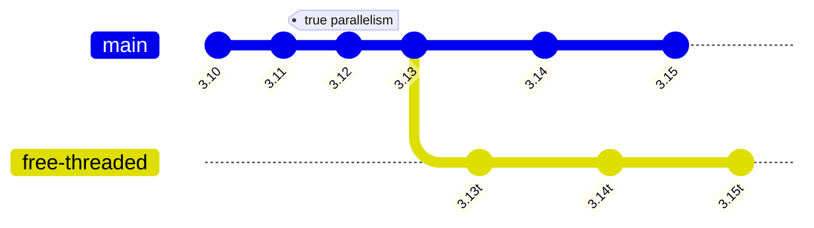
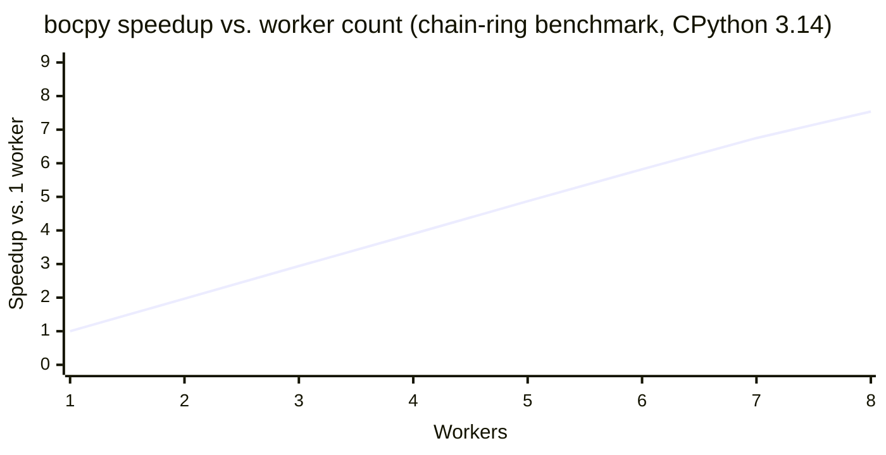

# bocpy


Behavior-Oriented Concurrency (*BOC*) is a new paradigm for parallel and concurrent
programming which is particularly well-suited to Python. In a BOC program, data is
shared such that each behavior has unique temporal ownership of the data, removing
the need for locks to coordinate access. For Python programmers, this brings a lot
of benefits. Behaviors are implemented as decorated functions, and from the programmer's
perspective, those functions work like normal. Importantly, the programmer's task
shifts from solving concurrent data access problems to organizing data flow through
functions. The resulting programs are easier to understand, easier to support, easier
to extend, and unlock multi-core performance due to the ability to schedule behaviors
to run efficiently across multiple sub-interpreters.

BOC has been implemented in several languages, including as a foundational aspect
of the research language Verona, and now has been implemented in Python. 

## Getting Started

You can install `bocpy` via PyPi:

    pip install bocpy

We provide pre-compiled wheels for Python 3.10 onwards on most platforms, but if
you have problems with your particular platform/version combination, please file
an issue on [this repository](https://github.com/microsoft/bocpy/issues).

> [!NOTE]
> We provide wheels for Python 3.10 and newer, but `bocpy` only achieves true
> parallelism on Python 3.12+, where each sub-interpreter has its own GIL. On
> 3.10 and 3.11 behaviors still run, but they are serialised by the global GIL.
> The library may not work on Python versions older than 3.10.

### Python version support

<!-- pypi-skip-start -->

<!-- pypi-skip-end -->

The mainline (`main`) branch in the diagram is the standard CPython build:

- **3.10 / 3.11** — wheels are published and `@when` works, but every
  sub-interpreter still shares one process-wide GIL, so behaviors execute one
  at a time. Use these versions for portability rather than performance.
- **3.12+** — each sub-interpreter gets its own GIL ([PEP 684][pep684]), so
  worker behaviors run in parallel across cores. This is where bocpy delivers
  on its concurrency story.
- **3.14** is the current default development and CI target; **3.15** is
  validated as it stabilises.

The `free-threaded` branch tracks the no-GIL CPython builds (informally
"3.13t", "3.14t", "3.15t" — see [PEP 703][pep703]). bocpy runs **unmodified**
on these interpreters today: we don't re-enable the GIL, and the cown / 2PL
protocol gives the same data-race-free guarantees you get on the GIL build.
The catch is overhead — on free-threaded Python, the sub-interpreter and
`XIData` machinery is pure ceremony, since plain threads in the main
interpreter would already run in parallel.

[Issue #5][issue5] tracks adding an alternative direct-threading backend that
detects a free-threaded interpreter at runtime and skips the
sub-interpreter / transpiler / `XIData` path entirely, while keeping the
public `Cown` / `@when` API unchanged. We're holding off on that work until
the free-threaded build and the relevant CPython APIs stabilise.

[pep684]: https://peps.python.org/pep-0684/
[pep703]: https://peps.python.org/pep-0703/
[issue5]: https://github.com/microsoft/bocpy/issues/5

### Scaling with cores

The chart below shows BOC runtime throughput as the worker count grows from
1 to 8, plotted as **speedup relative to a single worker**. Numbers come
from [examples/benchmark.py](examples/benchmark.py) — a chain-ring workload
that exercises the scheduler, two-phase locking, sub-interpreter crossings
and the message queue together — run on CPython 3.14 (mean of 3 repeats,
8 s each).

<!-- pypi-skip-start -->

<!-- pypi-skip-end -->

Up to 8 workers, BOC delivers roughly linear scaling on this microbenchmark
(≈7.5× at 8 workers). Real applications carry serial costs that this
benchmark deliberately strips out — see the docstring at the top of
[examples/benchmark.py](examples/benchmark.py) for the load-bearing
caveats. To reproduce:

```bash
python examples/benchmark.py \
    --sweep-axis workers --sweep-values 1,2,3,4,5,6,7,8 \
    --duration 8 --warmup 2 --repeats 3 \
    --output scaling.json
```

A behavior can be thought of as a function which depends on zero or more
concurrently-owned data objects (which we call **cowns**). As a programmer, you
indicate that you want the function to be called once all of those resources are
available. For example, let's say that you had two complex and time-consuming
operations, and you needed to act on the basis of both of their outcomes:

```python

def buy_cheese():
    logger = logging.getLogger("cheese_shop")
    for name in all_known_cheeses():
        if is_available(logger, name):
            return name
    
    cleanup_shop(logger)
    return None


def order_meal(exclude: str):
    logger = logging.getLogger("greasy_spoon")
    for dish in menu():
        logger.info(dish)
        if exclude.lower() not in dish.lower():
            logger.info(f"That doesn't have much {exclude} in it")
            return dish

        vikings(logger)
        if random.random() < 0.3:
            logger.info("<bloody vikings>")

    return None


cheese = buy_cheese()
meal = order_meal(exclude="spam")

if meal is not None:
    eat(meal)
elif cheese is not None:
    eat(cheese)

if meal is not None:
    print("I really wanted some cheese...")
elif cheese is not None:
    print("Cheesy comestibles")

return_to_library()
```

The code above will work, but requires the purveying of cheese and the navigation
of the menu for non-spam options to happen sequentially. If we wanted to do these
tasks in parallel, we will end up with some version of nested waiting, which can
result in deadlock. With BOC, we would write the above like this:

```python
from bocpy import wait, when, Cown

# ...

def buy_cheese():
    cheese = Cown(None)

    @when(cheese)
    def _(cheese):
        logger = logging.getLogger("cheese_shop")
        for name in all_known_cheeses():
            if is_available(logger, name):
                cheese.value = name
                return

        cleanup_shop(logger)

    return cheese


def order_meal(exclude: str):
    order = Cown(None)

    @when(order)
    def _(order):
        logger = logging.getLogger("greasy_spoon")
        logger.info("We have...")
        for dish in menu():
            logger.info(dish)
            if exclude.lower() not in dish.lower():
                logger.info(f"That doesn't have much {exclude} in it")
                order.value = dish
                return

            vikings(logger)
            if random.random() < 0.3:
                logger.info("<bloody vikings>")

    return order


cheese = buy_cheese()
meal = order_meal(exclude="spam")


@when(cheese, meal)
def _(cheese, meal):
    if meal.value is not None:
        eat(meal.value)
    elif cheese.value is not None:
        eat(cheese.value)
    else:
        print("<stomach rumbles>")


@when(cheese, meal)
def _(cheese, meal):
    if meal.value is not None:
        print("I really wanted cheese...")
    elif cheese.value is not None:
        print("Cheesy comestibles!")

    return_to_library()


wait()
```

You can view the full example
[here](https://github.com/microsoft/bocpy/blob/main/src/bocpy/examples/sketches.py)

The BOC runtime ensures that this operates without deadlock, by
construction.

### Talking to main-thread objects

Some values can't survive an XIData round-trip — pyglet shapes, Tk widgets,
open file handles, ctypes pointers into a library loaded by `__main__`, a
GPU context. Wrap those in a `PinnedCown`. Behaviors whose request set
contains any pinned cown run on the main thread, drained by `pump()` from
your event loop (or implicitly by `wait()`).

Keep dispatch coarse — one pinned `@when` per frame, not per item — so the
single-consumer main thread doesn't serialise your worker parallelism. The
`pump()` call drains whatever pinned behaviors are queued and returns
immediately when the queue is empty (it never blocks), so it is safe to
call from a tight render-loop tick. Hosts that want a starvation warning
when the queue stays non-empty can enable it explicitly with
`set_pump_watchdog()`; with no call, the runtime stays silent.

```python
from bocpy import Cown, PinnedCown, pump, start, when

start()
canvas = PinnedCown(MyCanvas())  # main-thread-only handle

def update(dt):
    pump()                                     # drains prior frame's write-back; returns immediately if nothing is queued
    results = [worker_compute(i) for i in range(n)]  # per-item worker @whens

    @when(*results, canvas)                    # one pinned behavior per frame
    def _writeback(*args):
        *cells, canvas = args
        for cell in cells:
            canvas.value.draw(cell.value)
```

See the [Pinned Cowns guide](https://microsoft.github.io/bocpy/pinned_cowns.html)
for the coarse-grained dispatch pattern, event-loop integration recipes
(pyglet, Tk, asyncio), and the starvation watchdog.

### Examples

We provide a few examples to show different ways of using BOC in a program:

1. [`bocpy-bank`](https://github.com/microsoft/bocpy/blob/main/src/bocpy/examples/bank.py): Shows an example
   where two objects (in this case, bank accounts), interact in an atomic way.
2. [`bocpy-dining-philosophers`](https://github.com/microsoft/bocpy/blob/main/src/bocpy/examples/dining_philosophers.py):
   The classic Dining Philosphers problem implemented using BOC.
3. [`bocpy-fibonacci`](https://github.com/microsoft/bocpy/blob/main/src/bocpy/examples/fibonacci.py): A
   parallel implementation of Fibonacci calculation.
4. [`bocpy-cooking-boc`](https://github.com/microsoft/bocpy/blob/main/src/bocpy/examples/cooking_boc.py): The example from
   the [BOC tutorial](https://microsoft.github.io/bocpy/).
5. [`bocpy-boids`](https://github.com/microsoft/bocpy/blob/main/src/bocpy/examples/boids.py): An agent-based bird flocking
   example demonstrating the `Matrix` class for parallel per-cell physics on
   workers, with one `PinnedCown`-driven `@when` per frame batching the
   pyglet-visible write-back (the coarse-grained pinned-dispatch pattern).
   Note: you'll need to install `pyglet` first in order to run the `bocpy-boids` example.
6. [`bocpy-primes`](https://github.com/microsoft/bocpy/blob/main/src/bocpy/examples/primes.py)
   and [`bocpy-prime-factor`](https://github.com/microsoft/bocpy/blob/main/src/bocpy/examples/prime_factor.py):
   parallel prime sieve and Pollard's rho factorisation, the latter coordinating
   early termination via the noticeboard.
7. [`bocpy-calculator`](https://github.com/microsoft/bocpy/blob/main/src/bocpy/examples/calculator.py):
   a small Erlang-style calculator service driven by `send`/`receive`.
8. [`bocpy-cooking-threads`](https://github.com/microsoft/bocpy/blob/main/src/bocpy/examples/cooking_threads.py):
   the cooking example written with plain threads, for comparison with `bocpy-cooking-boc`.
9. [`bocpy-sketches`](https://github.com/microsoft/bocpy/blob/main/src/bocpy/examples/sketches.py):
   the cheese-and-spam sketch shown above as a runnable script.


## Why BOC for Python?
Python has always had data races — compound operations like `x += 1` are not
atomic, even under the GIL — and with the arrival of free-threaded builds
(Python 3.13t+) the surface area for concurrency bugs is only growing. BOC
eliminates these problems by construction: because behaviors interact with
shared data exclusively through *cowns*, each behavior operates over its data
as if it were single-threaded. There is no lock ordering to get right, no
forgotten `acquire()`/`release()`, and no possibility of deadlock. This holds
whether your program runs under the GIL, on per-interpreter GIL (3.12+), or
on a free-threaded interpreter.

### This library
Our implementation is built on top of the sub-interpreters mechanism and the
Cross-Interpreter Data (`XIData`) API. As of Python 3.12 each sub-interpreter
has its own GIL, so behaviors scheduled by `bocpy` run truly in parallel.

The core scheduling engine is written in C — it is **not** a wrapper around
locks, message queues, or `asyncio`. Each `Cown` is backed by a C-level
capsule that embeds an MCS-style queue of pending behaviors. When you call
`@when(a, b)`, the runtime performs **two-phase locking** (2PL) over the
sorted cown IDs entirely in C (releasing the GIL across the lock-free link
loops). Once all cowns in a behavior's request set are acquired, the behavior
is dispatched directly to a worker — there is no central scheduler thread and
no OS-level lock acquisition on the fast path. Releasing a cown unlinks the
MCS node and hands ownership to the next waiting behavior in O(1), which is
then dispatched without touching any shared queue. This gives bocpy the same
deadlock-freedom-by-construction guarantee as the original Verona runtime.

For cross-behavior data sharing that does not warrant a `Cown`, the library
also provides a small **noticeboard** — a global key-value store of up to 64
entries. Behaviors can `notice_write`, `notice_update` (atomic
read-modify-write) and `notice_delete` keys without acquiring any cowns, and
read a frozen snapshot via `noticeboard()` / `notice_read()`. The
[`bocpy-prime-factor`](https://github.com/microsoft/bocpy/blob/main/src/bocpy/examples/prime_factor.py)
example uses it to coordinate early termination across worker behaviors.

For values that can't survive an XIData round-trip — UI handles, GPU
contexts, file descriptors — the library provides `PinnedCown`, a cown whose
value lives permanently in the main interpreter. Behaviors against a pinned
cown run on the main thread, drained by `pump()` from your event loop or
implicitly by `wait()`. The full surface is `PinnedCown`, `pump`,
`PumpResult`, `set_pump_watchdog`, and `set_wait_pump_poll`; the
[`bocpy-boids`](https://github.com/microsoft/bocpy/blob/main/src/bocpy/examples/boids.py)
example drives a pyglet window through one pinned `@when` per frame. See
the [Pinned Cowns guide](https://microsoft.github.io/bocpy/pinned_cowns.html)
for the coarse-grained dispatch pattern, watchdog, and free-threaded
support trajectory.

The library also includes lower-level Erlang-style messaging primitives
(`send` / `receive`) for channel-based communication patterns; see the
[API documentation](https://microsoft.github.io/bocpy/messaging.html) for
details.

### Waiting for completion

Call `wait()` after scheduling all your behaviors. It blocks the calling
thread until every scheduled behavior has finished, then tears down the
runtime (joins workers, closes the noticeboard). The next `@when` call will
spin up a fresh runtime automatically.

```python
wait()          # block indefinitely
wait(timeout=5) # raise TimeoutError if not done in 5 s
```

For a synchronization checkpoint that does **not** tear the runtime
down — e.g. a parallel search that inspects a best-so-far cown
between rounds and then continues — use `quiesce()` instead. It
blocks until every in-flight behavior completes, optionally returns
a per-worker stats or noticeboard snapshot, and leaves the worker
pool and the noticeboard thread running so the next `@when` call
dispatches immediately.

```python
from bocpy import quiesce

snap = quiesce(noticeboard=True)  # dict[str, Any]
print("best so far:", snap.get("best"))
# ... schedule the next round of @when calls ...
```

### Additional Info
BOC is built on a solid foundation of serious scholarship and engineering. For further reading, please see:
1. [When Concurrency Matters: Behaviour-Oriented Concurrency](https://dl.acm.org/doi/10.1145/3622852)
2. [Reference implementation in C#](https://github.com/microsoft/verona-rt/tree/main/docs/internal/concurrency/modelimpl)
3. [OOPSLA23 Talk](https://www.youtube.com/watch?v=iX8TJWonbGU)

## C API stability

bocpy is implemented as a CPython C extension that links against the
**private** cross-interpreter data API — `_PyXIData_*` on 3.14+,
`_PyCrossInterpreterData_*` on 3.12 / 3.13, and on 3.13+ the internal header
`internal/pycore_crossinterp.h` (which requires `Py_BUILD_CORE`). Under
[PEP 689][pep689] these symbols are explicitly *unstable*: they may change
shape, semantics, or disappear entirely between CPython minor releases, and
there is no PyPI / setuptools metadata field that advertises this kind of
dependency. The practical consequences are:

- **Per-minor wheels.** Because we do not target the limited API
  (`Py_LIMITED_API` / `abi3`), every wheel carries a version-specific ABI
  tag (`cp310`, `cp311`, …, `cp315`). pip will only install a wheel that
  matches the running interpreter's minor version. The `Programming
  Language :: Python :: 3.x` classifiers in [pyproject.toml](pyproject.toml)
  mirror this set.
- **Source builds may lag CPython.** Alpha / beta / RC builds of a new
  CPython minor frequently rename or reshape these private symbols. When
  that happens, bocpy's `xidata.h` shim needs an update before it will
  compile against the new headers; until then, install on a released
  minor version.
- **No CPython implementation other than CPython itself.** The internal
  cross-interpreter machinery is CPython-specific, which is why the only
  implementation classifier we set is
  `Programming Language :: Python :: Implementation :: CPython`. PyPy,
  GraalPy, and other alternatives are not supported.

The compatibility ladder lives in
[src/bocpy/include/bocpy/xidata.h](src/bocpy/include/bocpy/xidata.h);
the `Py_BUILD_CORE` `#define` / `#undef` save-and-restore there is scoped
narrowly to the one `#include` that needs it, so downstream C extensions
that pull in `bocpy.h` do **not** inherit it.

[pep689]: https://peps.python.org/pep-0689/

> **Trademarks** This project may contain trademarks or logos for projects, products, or services.
> Authorized use of Microsoft trademarks or logos is subject to and must follow Microsoft's
> Trademark & Brand Guidelines. Use of Microsoft trademarks or logos in modified versions of this
> project must not cause confusion or imply Microsoft sponsorship. Any use of third-party
> trademarks or logos are subject to those third-party's policies.
